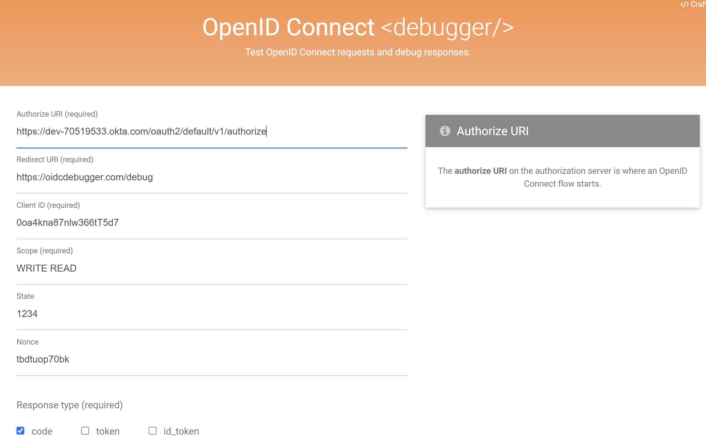
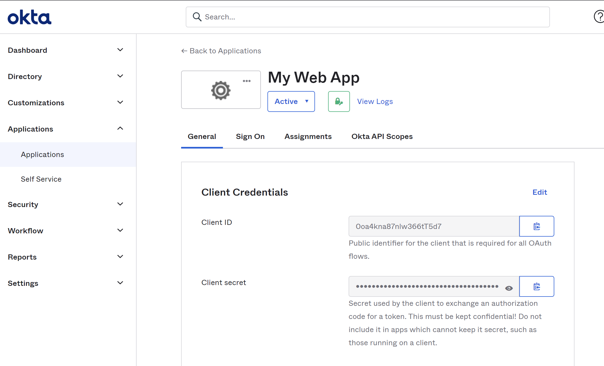
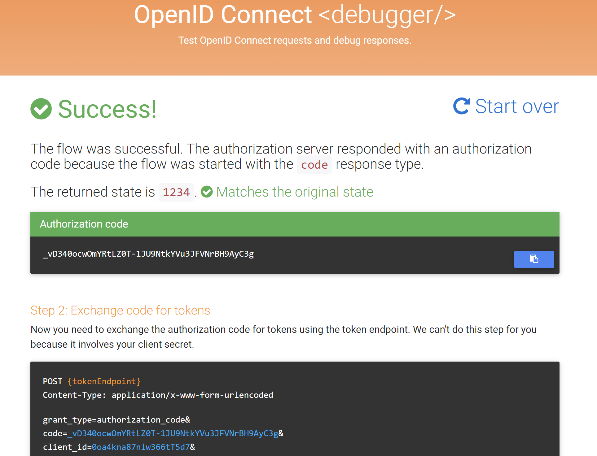

# Resource Server with Okta Authorization Server
This repository contains the resource server code that works with Authorization Server. See the link https://developer.okta.com/docs/concepts/auth-servers/#org-authorization-server-discovery-endpoints #
to learn more about Auth Servers in Okta.

# Pre-requisites 
You need to create an okta account and then do the following setups:
- Create App Integration
- Add Authorization Server
  - Add READ and WRITE scopes
  
# Steps
1. Get authorization code from Authorization Server
   1. Browse https://oidcdebugger.com/
   
      1. Authorize URI (required): https://yourOktaDomain/oauth2/default/v1/authorize
      2. Redirect URI (required): https://oidcdebugger.com/debug
      3. Client ID (required): Client Id of your web application in Okta
      
      4. Scope (required): READ, WRITE or both
      5. State: 1234
      6. Nonce: Leave default value as it is 
      7. Response type (required): code
      8. Response mode (required): form_post
      9. Click SEND REQUEST button. The result should look like this: 
      10. Copy the "Authorization code"

2. Get access token from Authorization Server  

   `curl -X POST 'https://yourOktaDomain/oauth2/default/v1/token' \  
   -H 'Content-Type: application/x-www-form-urlencoded' \  
   -H 'Cookie: DT=DI0GEhyas1vRI-Wj7mAgbEcEg' \  
   --data-urlencode 'grant_type=authorization_code' \  
   --data-urlencode 'code={authorizationCode}' \  
   --data-urlencode 'client_id={clientId}' \  
   --data-urlencode 'client_secret={clientSecret}' \  
   --data-urlencode 'redirect_uri=https://oidcdebugger.com/debug'`  

3. Run as JwtResourceServerOktaApplication as a Java project.

4. Call the endpoint you want to test  
`` curl -X GET 'http://localhost:9090/getProducts' -H 'Authorization: Bearer $your_access_token' ``